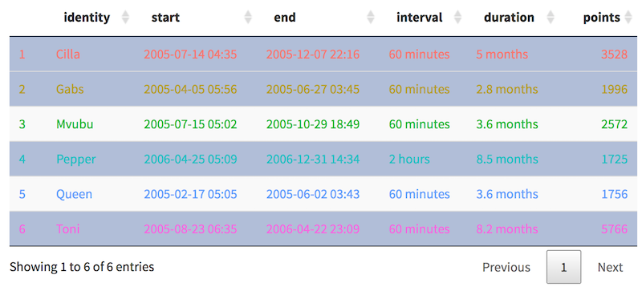

### Current subset of individuals
**All plots and actions are based on `current subset of individuals`**, which are 
- if no rows selected in table, current page
- with rows selected, the individuals that are selected. You can click to select/deselect (with shift to select/deselect a range), or use `Select All` and `Clear Selection` buttons, which apply to all pages.

- Certain features will only work with single individual as current subset, like `Time subsetting` and `Crop Subset`.

### Individuals table
- The color of rows match the colors in other plots. You can *customize rows per page*, *sort the rows by column*, or *use the search box to filter by name*.
- Current subset can be exported as csv file with `Export Current` button. If `Keep Outliers` is selected, picked outliers will be saved as manually marked outliers in csv, which can be imported to Movebank website and be recognized. Otherwise the picked outliers will be removed.
- The interval/duration are formated with human readable time units, see [this](https://ctmm-initiative.github.io/ctmm/reference/unit.html) for details.

### Plots
Select more individuals can show them all at once, select less individuals can show more details. `Canvas Size` can be used to adjust the figure sizes for all plots in Animal Locations box.
- `2. Overview`: plot showed individual relative locations. Other individuals in dataset is drawn as a gray background for context, which can be turnd off to focus on selected individuals only.
  - With only one individual is selected, draw a crop box on plot then click `Crop Subset` will crop that part into a new sub dataset.
- `3. Facet`: draw each individual separately which avoided the overlap. It's easy to compare patterns because X axes are aligned, and all scales are same.
- `4. Individual`: render individuals separately, centered by each, and still in same scale. The zoom slider will zoom into the center portion of all plots at the same time. This can exclude the outlier points in view quickly.
- `5. Error`: information about device error. See help box in tab for more details.
- `6. Sampling Time`: the histogram of measurement timestamps.

### Common features of plots
- The color theme for each individual is maintained as much as possible across tables, plots and pages.
- For all independent scatter plot (except facet or other grouped plot) in app (like plot 2 in this page), you can draw a rectangle with mouse button pressed, then double click inside the rectangle to **zoom in**. Double click in plot reset the zoom in.
