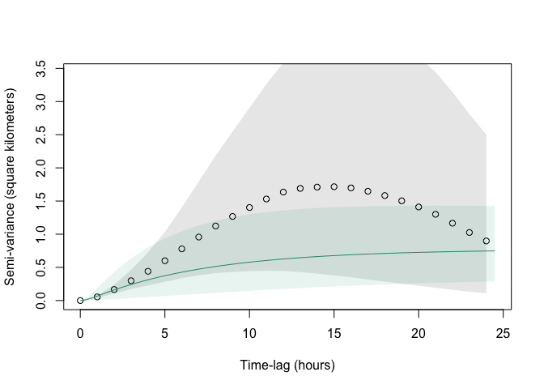
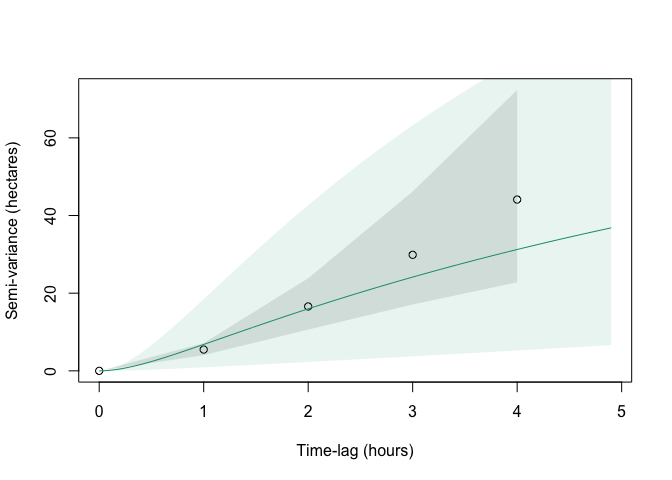

# simple sample work report
This is a proof of concept sample report for app v0.0.1. The ideal work report should reproduce all actions happened in app, which will be very challenging to generate.


```r
if (!require("pacman")) install.packages("pacman")
```

```
## Loading required package: pacman
```

```r
pacman::p_load(ctmm, ggplot2)
# library(manipulate)
```


```r
# data, plot ----
data("buffalo")
# use a generic animal name
# reduce data size for faster testing
animal_1 <- buffalo[[1]]
```

smaller dataset to make fitting faster. difficult to sample object, use smalle csv instead. but the fitting is nonlinear optimizing, small data may need more time to stable. format relatiely simpler may require less time. wrong data may take forever to fit.
do not use sample, take data by order


```r
data_file <- "data/buffalo/sample-50.csv"
animal_1 <- as.telemetry(data_file)
```

```
## Maximum speed of 0.442809118686115 m/s observed in Queen
```

```
## Minimum sampling interval of 240 s in Queen
```


```r
#Plot the positions
plot(animal_1)
```


```r
ggplot(data = animal_1, aes(x, y)) + 
      geom_point() +
      coord_fixed()
```


```r
# variogram ----
vg.animal_1 <- variogram(animal_1)
#Plot up to 50% of the maximum lag in the data
plot(vg.animal_1)
```


```r
#Zoom in on the shortest lags
plot(vg.animal_1, fraction = 0.1)
```


```r
# find the turning point for flatten curve.
# zoom(vg.animal_1)

# variogram.fit ----
#Use the sliders provided by variogram.fit to specify starting values.
#The default choices are usually acceptable.
# variogram.fit(vg.animal_1)
# variogram.fit(vg.animal_1, interactive = FALSE)
guessed <- ctmm.guess(animal_1, interactive = FALSE)
# returning single model now so no need verbose. if no verbose, return value is single element instead of list.
fitted.mod <- ctmm.select(animal_1, CTMM = guessed)
summary(fitted.mod)
```

```
## $DOF
##     mean     area 
## 4.263374 7.804172 
## 
## $CI
##                                low       ML      high
## area (square kilometers)  5.495251 12.89128  23.38624
## tau position (hours)      1.049238  6.95827  46.14542
## tau velocity (minutes)    2.291128 22.75509 225.99970
## speed (kilometers/day)   13.673894 18.35804  23.03324
```

```r
ouf <- fitted.mod  # used to be fitted.mods[[1]] if verbose = TRUE
plot(vg.animal_1, CTMM = ouf, col.CTMM = "#1b9e77")
```



```r
plot(vg.animal_1,
    CTMM = ouf,
    col.CTMM = "#1b9e77",
    fraction = 0.1)
```



```r
summary(ouf)
```

```
## $DOF
##     mean     area 
## 4.263374 7.804172 
## 
## $CI
##                                low       ML      high
## area (square kilometers)  5.495251 12.89128  23.38624
## tau position (hours)      1.049238  6.95827  46.14542
## tau velocity (minutes)    2.291128 22.75509 225.99970
## speed (kilometers/day)   13.673894 18.35804  23.03324
```

```r
akde.animal_1 <- akde(animal_1,CTMM = ouf)
summary(akde.animal_1)
```

```
## $DOF
##      area bandwidth 
##  7.804172  6.785531 
## 
## $CI
##                               low       ML     high
## area (square kilometers) 6.145174 14.41593 26.15212
```

```r
plot(animal_1, UD = akde.animal_1)
```


