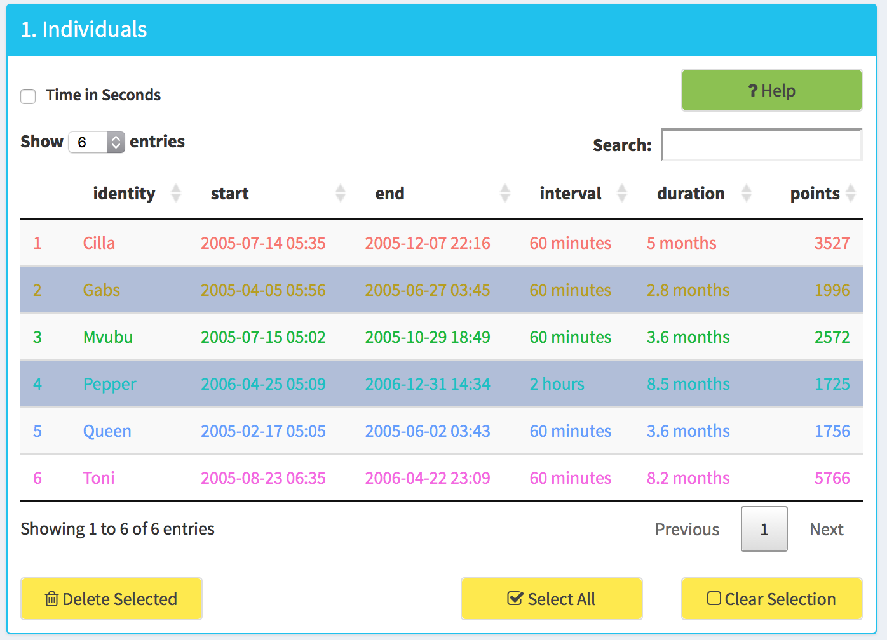
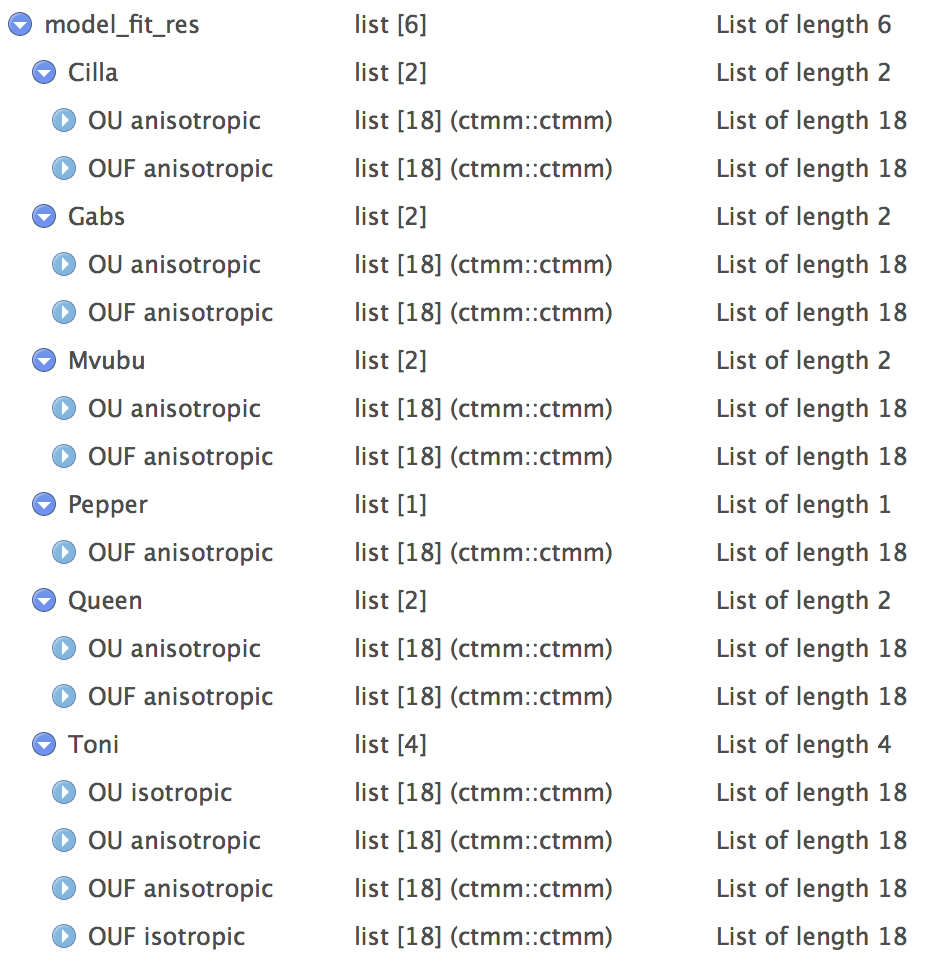

```{r setup, include = FALSE}
knitr::opts_chunk$set(
  collapse = TRUE,
  comment = "#>",
  fig.path = "fig/"
)
```

## Introduction
- how to use package functions in analysis.
- Since most functions belong to a workflow, it's easier to put all functions usage examples in a workflow example than giving individual code examples in function help.
- test code, write document individually, but not to knit document in building site until final version.
- compare the ctmm vignette

```{r libraries and data, eval=TRUE}
library(ctmm)
library(ctmmweb)
data(buffalo)
```

To plot multiple animals location with `ggplot2`, we need to merge all location data into a single `data.frame`. `merge_tele` will merge ctmm telemetry object/list into a list of location `data.table` and information `data.table`. `data.table` is compatible with `data.frame` but with much better performance.

```{r basic data structure}
# basic data structure
merged_data <- merge_tele(buffalo)
# a list of locations data.table/data.frame and information table
# 
head(merged_data)
dt <- merged_data$data
info <- merged_data$info
```

In app we can select a subset of full data by slecting rows in the data summary table 1.




To select a subset in script, we can select animal names for `identity` column or numbers for `id` factor column in `dt` with `data.table` syntax. `data.table` is also `data.frame` so you can use `data.frame` synatax too.

It's suggested to always select a subset from full data like this, because the subset will carry the `id` column which still hold all animal names in levels, then a consistent color mapping can be maintained(otherwise `ggplot2` will always draw first animal in same color).

```{r select subset}
# select by identity column
selected_dt <- dt[identity %in% c("Gabs", "Queen")]
# select by id factor column value
dt[as.numeric(id) %in% c(1, 3)]
```

## Visualization

You can reproduce most of the plots in `Visualization` page with functions. 

```{r plot location and time, eval=TRUE}
# plot animal locations
plot_loc(dt)
# plot a subset only. Note the color mapping is consistent because selected_dt  id column hold all animal names in levels.
plot_loc(selected_dt)
# with subset and full data set both provided, subset will be drawn with full data as background. 
plot_loc(selected_dt, dt)
# location in facet
plot_loc_facet(selected_dt)
# sampling time
plot_time(selected_dt)
# take the ggplot2 object to further customize it
plot_loc(selected_dt, dt) +
  ggplot2::ggtitle("Locations of Buffalos") +
  # override the default left alignment of title and make it bigger
  ctmmweb:::CENTER_TITLE
# export plot
g <- plot_loc(selected_dt, dt)
ggplot2::ggsave("pic/test.png", g)
```

## model summary table

Fit models on data in parallel with `ctmm::ctmm.select`.

```{r model summary, eval=FALSE}
# take a 100 point sample from each animal so the model fitting can finish quicker
data_sample <- sample_tele_list(buffalo, 100)
# fit models in parallel.
model_fit_res <- par_fit_tele(data_sample)
# a data.table of models information summary
summary_model_fit(model_fit_res)
```

`ctmm::ctmm.select` may fit multiple models for each animal if they are validate candidates. In the app you can select a subset of models and check the variograms, home ranges and occurrences based on them. Similarly, in R script you need to select a subset of models first.

The result list from `ctmm::ctmm.select` hold every model for same animal under a list item of animal name. We need to convert it into a flat list to make the selection easier.




```{r select models}
# the nested structure of model fit result
names(model_fit_res)
names(model_fit_res[[1]])

# select subset in model summary table

# apply model names to model fit res to get subset of model list.
```

main parameters: model names vec, model list with names.

- generate proper dt with model list column, or just the model list with names? which should be enough for command line usage.
- select models, use the model summary table for selection, model number?
- check the parameter needed for following code


## variogram, home range, occurrence

```{r variogram, eval=FALSE}

```

```{r home range}

```

- with 100 sample, the Gabs 2nd model, OUF ani have error in occurrence plot? report this with reproducible code, also test with different sample size.
```{r occurrence}

```

## map

```{r point map, eval=TRUE}
# this is needed for using pipe operator
library(leaflet)
point_map(selected_dt, dt)
# add control. This is not a part of point_map function because we can only add control once and after all layers are added. If we want to overlay home range over points, we need to add control after home range layer are added.
point_map(selected_dt, dt) %>% 
  add_control(get_names(selected_dt))

# save map to html

```

- to add home range, there is no wrapped less parameter version because we need lots of information and need some flexibility (base map, controls have to be added later). It's actually easier to use the app to add home range, since it involves model selection, color assignment etc
- need to export add_home_range_list, maybe put names to range_list names.
```{r home range map, eval=FALSE}
base_map() %>% 
  add_home_range_list(hrange_list, hr_levels, hr_color_vec) %>% 
  add_control(model_names)

point_map(selected_dt, dt) %>% 
  add_home_range_list(hrange_list, hr_levels, hr_color_vec) %>% 
  add_control(c(get_names(selected_dt), model_names))

# save to html

```

## Other utility functions
code example for each function since we didn't put code example in help.
- disctance, speed outlier

### generic parallel function usage
```{r parallel, eval=FALSE}
# sample a telemetry object to test time consuming processes with less time
sample_tele(buffalo[[1]], 100)
# generic parallel usage
```
